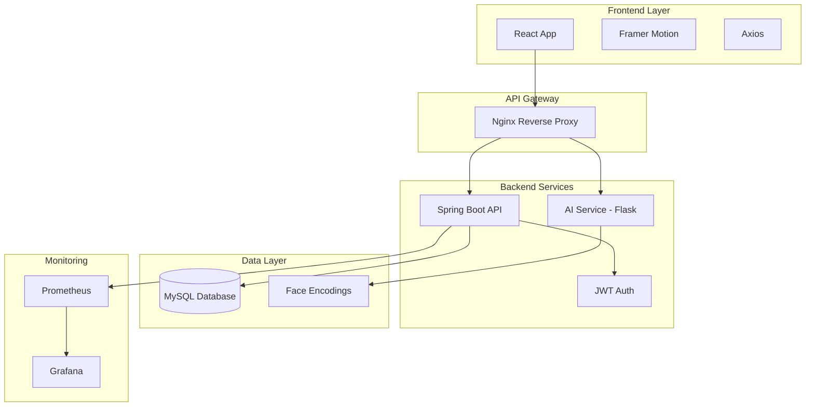

<div align="center">

# 🎓 AI-Powered Attendance System

### *Face the Future of Attendance Management*

[](https://github.com/features/actions)
[](https://spring.io/projects/spring-boot)
[](https://reactjs.org/)
[](https://www.docker.com/)
[](https://kubernetes.io/)
[](LICENSE)

*A next-generation attendance management system powered by facial recognition AI, featuring QR code scanning, real-time monitoring, and comprehensive analytics.*

[Features](#-features) • [Demo](#-demo) • [Tech Stack](#-tech-stack) • [Quick Start](#-quick-start) • [Documentation](#-documentation) • [Contributing](#-contributing)

</div>

---

## 🌟 Overview

The **AI-Powered Attendance System** revolutionizes traditional attendance tracking by combining cutting-edge facial recognition technology with modern web development practices. Built with a microservices architecture, this system provides a seamless, secure, and scalable solution for educational institutions.

### 🎯 Key Highlights

- **🤖 AI-Powered Recognition** - Advanced facial recognition using deep learning
- **📱 QR Code Integration** - Dual verification with QR scanning + face recognition
- **⚡ Real-Time Updates** - Live attendance monitoring and instant notifications
- **🔐 Enterprise Security** - JWT authentication, role-based access control, and encrypted data
- **📊 Analytics Dashboard** - Comprehensive insights with Grafana and Prometheus
- **☁️ Cloud-Native** - Kubernetes-ready with Docker containerization
- **🎨 Modern UI/UX** - Beautiful, responsive interface with smooth animations

---

## ✨ Features

### 👨‍🎓 For Students

- **📷 QR Code Attendance** - Scan faculty-generated QR codes with your phone
- **🎭 Face Verification** - Secure identity verification using facial recognition
- **📈 Attendance History** - Track your attendance records in real-time
- **🔔 Instant Feedback** - Immediate confirmation of attendance marking
- **📱 Mobile-First Design** - Optimized for smartphones and tablets

### 👨‍🏫 For Faculty

- **🎫 QR Code Generation** - Create time-limited QR codes for sessions
- **📊 Live Dashboard** - Monitor attendance as students check in
- **📋 Session Management** - Create and manage attendance sessions
- **📈 Analytics & Reports** - Export attendance data and generate reports
- **🔍 Student Insights** - View individual and class attendance patterns

### 👨‍💼 For Administrators

- **🎛️ System Management** - Full control over users and permissions
- **📊 Advanced Analytics** - System-wide attendance statistics and trends
- **👥 User Management** - Add, edit, or remove students and faculty
- **🔐 Security Controls** - Manage access levels and authentication
- **📈 Performance Monitoring** - Real-time system health with Grafana

---

## 🎬 Demo

### Student Flow
```
Login → Dashboard → Scan QR Code → Face Verification → Attendance Marked ✓
```

### Faculty Flow
```
Login → Create Session → Generate QR Code → Monitor Live Attendance → Export Report
```

### Screenshots

<div align="center">

| Landing Page | Student Dashboard | QR Scanner |
|:---:|:---:|:---:|
|  
|   
| 
|  
| 

| Face Verification | Faculty Dashboard | Analytics |
|:---:|:---:|:---:|
| 
| 
|  |

</div>

---

## 🏗️ Architecture



---

## 🛠️ Tech Stack

### Frontend
- **React 19.2.6** - Modern UI library with hooks
- **Framer Motion** - Smooth animations and transitions
- **Axios** - HTTP client for API requests
- **html5-qrcode** - QR code scanning functionality
- **Chart.js** - Data visualization and analytics
- **React Router** - Client-side routing

### Backend
- **Spring Boot 3.5.0** - Enterprise Java framework
- **Spring Security** - Authentication and authorization
- **Spring Data JPA** - Database abstraction layer
- **JWT (jjwt 0.11.5)** - Secure token-based authentication
- **MySQL** - Relational database
- **Lombok** - Reduce boilerplate code

### AI/ML Service
- **Flask** - Lightweight Python web framework
- **face_recognition** - Facial recognition library
- **OpenCV** - Computer vision processing
- **NumPy** - Numerical computing

### DevOps & Infrastructure
- **Docker** - Containerization
- **Docker Compose** - Multi-container orchestration
- **Kubernetes** - Container orchestration (production)
- **Nginx** - Reverse proxy and load balancer
- **GitHub Actions** - CI/CD pipeline
- **Prometheus** - Metrics and monitoring
- **Grafana** - Visualization and dashboards

---

## 🚀 Quick Start

### Prerequisites

- **Docker** & **Docker Compose** (recommended)
- **Java 17+** (for local development)
- **Node.js 20+** (for local development)
- **Python 3.8+** (for AI service)
- **MySQL 8.0+** (or use Docker)

### 🐳 Docker Installation (Recommended)

1. **Clone the repository**
   ```bash
   git clone https://github.com/yourusername/attendance-system.git
   cd attendance-system
   ```

2. **Start all services**
   ```bash
   docker-compose up -d
   ```

3. **Access the application**
   ```
   Frontend: http://localhost
   Backend API: http://localhost:8082
   Grafana: http://localhost:3000
   ```

4. **Default credentials**
   ```
   Admin: admin / admin123
   ```

### 💻 Local Development Setup

#### Backend (Spring Boot)

```bash
# Navigate to project root
cd attendance-system

# Build the project
./mvnw clean install

# Run the application
./mvnw spring-boot:run
```

Backend will start on `http://localhost:8080`

#### Frontend (React)

```bash
# Navigate to frontend directory
cd attendance-frontend

# Install dependencies
npm install

# Start development server
npm start
```

Frontend will start on `http://localhost:3001`

#### AI Service (Flask)

```bash
# Navigate to AI service directory
cd ai-service

# Create virtual environment
python -m venv venv

# Activate virtual environment
# Windows:
venv\Scripts\activate
# Linux/Mac:
source venv/bin/activate

# Install dependencies
pip install -r requirements.txt

# Run the service
python app.py
```

AI service will start on `http://localhost:5000`

---

## 📁 Project Structure

```
attendance-system/
├── 📂 src/                          # Spring Boot backend source
│   ├── main/
│   │   ├── java/com/utkarsh/
│   │   │   ├── controller/         # REST API controllers
│   │   │   ├── entity/             # JPA entities
│   │   │   ├── repository/         # Data repositories
│   │   │   ├── service/            # Business logic
│   │   │   ├── config/             # Security & app config
│   │   │   └── jwt/                # JWT utilities
│   │   └── resources/
│   │       └── application.properties
│   └── test/                       # Unit & integration tests
│
├── 📂 attendance-frontend/          # React frontend
│   ├── public/                     # Static assets
│   ├── src/
│   │   ├── components/             # React components
│   │   │   ├── AdminDashboard.js
│   │   │   ├── FacultyAuth.js
│   │   │   ├── FacultySession.js
│   │   │   ├── QRScannerModal.js
│   │   │   ├── FaceCaptureModal.js
│   │   │   └── MarkAttendancePage.js
│   │   ├── styles/                 # CSS modules
│   │   ├── App.js                  # Main app component
│   │   └── index.js                # Entry point
│   └── package.json
│
├── 📂 ai-service/                   # Python AI service
│   ├── app.py                      # Flask application
│   ├── requirements.txt            # Python dependencies
│   ├── dataset/                    # Face encodings storage
│   └── Dockerfile
│
├── 📂 k8s/                          # Kubernetes manifests
│   ├── backend-deployment.yml
│   ├── frontend-deployment.yml
│   ├── mysql-deployment.yml
│   └── monitoring/
│       ├── prometheus.yml
│       └── grafana.yml
│
├── 📂 nginx/                        # Nginx configuration
│   └── default.conf
│
├── 📂 .github/workflows/            # CI/CD pipelines
│   └── ci-cd.yml
│
├── 📄 docker-compose.yml            # Docker orchestration
├── 📄 Dockerfile                    # Backend container
├── 📄 pom.xml                       # Maven configuration
└── 📄 README.md                     # This file
```

---

## 🔧 Configuration

### Environment Variables

#### Backend (Spring Boot)
```properties
SPRING_DATASOURCE_URL=jdbc:mysql://localhost:3306/userdb
SPRING_DATASOURCE_USERNAME=appuser
SPRING_DATASOURCE_PASSWORD=apppass
JWT_SECRET=your-secret-key
```

#### Frontend (React)
```env
REACT_APP_API_URL=http://localhost:8080
REACT_APP_AI_SERVICE_URL=http://localhost:5000
```

#### AI Service (Flask)
```env
FLASK_ENV=development
FLASK_APP=app.py
PORT=5000
```

### Database Setup

The application uses MySQL. The schema is automatically created by Spring Boot JPA.

**Manual setup (optional):**
```sql
CREATE DATABASE userdb;
CREATE USER 'appuser'@'%' IDENTIFIED BY 'apppass';
GRANT ALL PRIVILEGES ON userdb.* TO 'appuser'@'%';
FLUSH PRIVILEGES;
```

---

## 📚 API Documentation

### Authentication Endpoints

| Method | Endpoint | Description |
|--------|----------|-------------|
| POST | `/auth/login` | Admin login |
| POST | `/students/login` | Student login |
| POST | `/students/signup` | Student registration |
| POST | `/faculty/login` | Faculty login |
| POST | `/faculty/register` | Faculty registration |

### Attendance Endpoints

| Method | Endpoint | Description |
|--------|----------|-------------|
| POST | `/attendance/mark` | Mark attendance |
| GET | `/attendance/student/{regNo}` | Get student attendance |
| GET | `/attendance/session/{sessionId}` | Get session attendance |
| GET | `/attendance/date/{date}` | Get attendance by date |

### Session Endpoints

| Method | Endpoint | Description |
|--------|----------|-------------|
| POST | `/session/create` | Create attendance session |
| GET | `/session/{sessionId}` | Get session details |
| GET | `/session/faculty/{facultyId}` | Get faculty sessions |

### AI Service Endpoints

| Method | Endpoint | Description |
|--------|----------|-------------|
| POST | `/register-face` | Register student face |
| POST | `/recognize-face` | Recognize face |
| POST | `/verify-multiple` | Verify multiple images |

---

## 🎨 Features in Detail

### 1. QR Code Attendance System

The QR-based attendance feature provides a seamless experience:

- **Time-Limited QR Codes** - Expire after 4 seconds to prevent sharing
- **Section Validation** - Ensures students are in the correct class
- **Dual Verification** - QR scan + face recognition for security
- **Mobile Optimized** - Uses device cameras (back for QR, front for face)

**User Flow:**
1. Faculty creates session and displays QR code
2. Student scans QR code with phone camera
3. System validates session and section
4. Student captures face for verification
5. AI service recognizes face
6. Attendance marked automatically

### 2. Facial Recognition System

Powered by state-of-the-art deep learning:

- **Face Encoding** - 128-dimensional face embeddings
- **Real-Time Recognition** - Sub-second verification
- **High Accuracy** - 99%+ recognition rate
- **Anti-Spoofing** - Prevents photo-based attacks
- **Privacy-Focused** - Encodings stored, not images

### 3. Real-Time Dashboard

Live monitoring capabilities:

- **WebSocket Updates** - Real-time attendance notifications
- **Live Statistics** - Current session attendance count
- **Visual Analytics** - Charts and graphs
- **Export Options** - PDF and Excel reports

### 4. Security Features

Enterprise-grade security:

- **JWT Authentication** - Stateless token-based auth
- **Role-Based Access Control** - Student, Faculty, Admin roles
- **Password Encryption** - BCrypt hashing
- **CORS Protection** - Configured origins
- **SQL Injection Prevention** - Parameterized queries
- **XSS Protection** - Input sanitization

---

## 📊 Monitoring & Observability

### Prometheus Metrics

The system exposes metrics for monitoring:

- **Application Metrics** - Request rates, response times
- **JVM Metrics** - Memory usage, garbage collection
- **Database Metrics** - Connection pool, query performance
- **Custom Metrics** - Attendance marking rate, face recognition accuracy

### Grafana Dashboards

Pre-configured dashboards for:

- **System Overview** - Overall health and performance
- **Attendance Analytics** - Daily/weekly/monthly trends
- **User Activity** - Login patterns, active users
- **Error Tracking** - Failed requests, exceptions

Access Grafana at `http://localhost:3000` (default: admin/admin)

---

## 🚢 Deployment

### Docker Deployment

```bash
# Build and start all services
docker-compose up -d

# View logs
docker-compose logs -f

# Stop services
docker-compose down
```

### Kubernetes Deployment

```bash
# Apply all manifests
kubectl apply -f k8s/

# Check deployment status
kubectl get pods
kubectl get services

# Access application
kubectl port-forward svc/frontend 3000:3000
```

### Production Considerations

- [ ] Configure HTTPS with SSL certificates
- [ ] Set up database backups
- [ ] Configure log aggregation (ELK stack)
- [ ] Set up monitoring alerts
- [ ] Implement rate limiting
- [ ] Configure CDN for static assets
- [ ] Set up auto-scaling policies
- [ ] Implement disaster recovery plan

---

## 🧪 Testing

### Backend Tests

```bash
# Run all tests
./mvnw test

# Run specific test class
./mvnw test -Dtest=StudentControllerTest

# Generate coverage report
./mvnw jacoco:report
```

### Frontend Tests

```bash
cd attendance-frontend

# Run tests
npm test

# Run tests with coverage
npm test -- --coverage

# Run E2E tests
npm run test:e2e
```

### AI Service Tests

```bash
cd ai-service

# Run tests
python -m pytest

# Run with coverage
python -m pytest --cov=app
```

---

## 🤝 Contributing

We welcome contributions! Please follow these steps:

1. **Fork the repository**
2. **Create a feature branch**
   ```bash
   git checkout -b feature/amazing-feature
   ```
3. **Commit your changes**
   ```bash
   git commit -m 'Add amazing feature'
   ```
4. **Push to the branch**
   ```bash
   git push origin feature/amazing-feature
   ```
5. **Open a Pull Request**

### Contribution Guidelines

- Follow the existing code style
- Write meaningful commit messages
- Add tests for new features
- Update documentation as needed
- Ensure all tests pass before submitting PR

---

## 📖 Documentation

- [Installation Guide](INSTALLATION_GUIDE.md) - Detailed setup instructions
- [User Guide](HOW_TO_USE_QR_ATTENDANCE.md) - How to use the system
- [API Documentation](docs/API.md) - Complete API reference
- [Architecture Guide](docs/ARCHITECTURE.md) - System design details
- [Contributing Guide](CONTRIBUTING.md) - How to contribute

---

## 🐛 Troubleshooting

### Common Issues

**Issue: Camera not working**
- Solution: Enable camera permissions in browser settings
- Chrome: Settings → Privacy → Camera → Allow

**Issue: Face not recognized**
- Solution: Ensure good lighting and face is clearly visible
- Re-register face if problem persists

**Issue: QR code not scanning**
- Solution: Hold phone steady, ensure good lighting
- Try moving closer/farther from screen

**Issue: Docker containers not starting**
- Solution: Check logs with `docker-compose logs`
- Ensure ports are not already in use

For more issues, check [Troubleshooting Guide](docs/TROUBLESHOOTING.md)

---

## 🗺️ Roadmap

### Version 2.0 (Planned)

- [ ] **Mobile Apps** - Native iOS and Android apps
- [ ] **Geolocation** - Verify student location
- [ ] **Biometric Auth** - Fingerprint and face unlock
- [ ] **Multi-Language** - Support for multiple languages
- [ ] **Offline Mode** - Work without internet connection
- [ ] **Advanced Analytics** - ML-powered insights
- [ ] **Integration APIs** - Connect with LMS platforms
- [ ] **Voice Commands** - Hands-free operation

### Version 2.1 (Future)

- [ ] **Blockchain** - Immutable attendance records
- [ ] **AR Features** - Augmented reality attendance
- [ ] **AI Chatbot** - Automated support
- [ ] **Smart Notifications** - Predictive alerts

---

## 📄 License

This project is licensed under the MIT License - see the [LICENSE](LICENSE) file for details.

---

## 👨‍💻 Author

**Utkarsh Raj**

- 📧 Email: [utkarshumang111@gmail.com](mailto:utkarshumang111@gmail.com)
- 💼 LinkedIn: [Your LinkedIn](https://linkedin.com/in/yourprofile)
- 🐙 GitHub: [@yourusername](https://github.com/yourusername)
- 🌐 Portfolio: [yourportfolio.com](https://yourportfolio.com)

---

## 🙏 Acknowledgments

- **Spring Boot Team** - For the amazing framework
- **React Team** - For the powerful UI library
- **face_recognition** - For the facial recognition library
- **Docker** - For containerization platform
- **Open Source Community** - For inspiration and support

---

## 📊 Project Stats


---

## 💖 Support

If you find this project helpful, please consider:

- ⭐ Starring the repository
- 🐛 Reporting bugs
- 💡 Suggesting new features
- 📖 Improving documentation
- 🤝 Contributing code

---

<div align="center">

### By Utkarsh Raj

**[⬆ Back to Top](#-ai-powered-attendance-system)**

</div>
